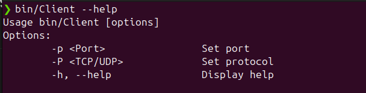

# ClientServer
Простое клиент-серверное приложение поддерживающее общение между сервером и клиентом. Реализовано на сокетах, поддерживает общение по протоколам UDP и TCP.

## Build
```cmd
make # Собрать проект
```

```
bin/Server -P [TCP/UDP] -p [port] # Запустить сревер
# Example: bin/Server -P TCP -p 10000
```

```
bin/Client -P [TCP/UDP] -p [port] # Запустить клиент
# Example: bin/Client -P TCP -p 10000
```


## Client
Клиент умеет только отправлять сообщения серверу.


Клиент отправил сообщение.


## Server

Сервер поддерживает работу обмена сообщениями с несколькими клиентами одновременно в режиме TCP или UDP.


Подключение клиента.


Клиент отправил сообщение.


Сервер ответил.


Небольшой диалог.


Можно посмотреть историю сообщение между сервером и клиентом.


Клиент отключился.


Можно посмотреть список ID подключенных клиентов.


Можно посмотреть список ID отключенных клиентов.


Все команды сервера.


Так же, тот же функционал сервер поддерживает в режиме UDP подключенний. Отключение UDP клиента происхоидт по таймауту. В режиме UDP, если к серверу придет сообщение от клиента, которого он отключил, он вспомнит его и не будет создавать новый ID.

## Console
Консоль обрабатывается вручную, благодаря чему неважно когда приходят сообщения, вывод будет правильный.